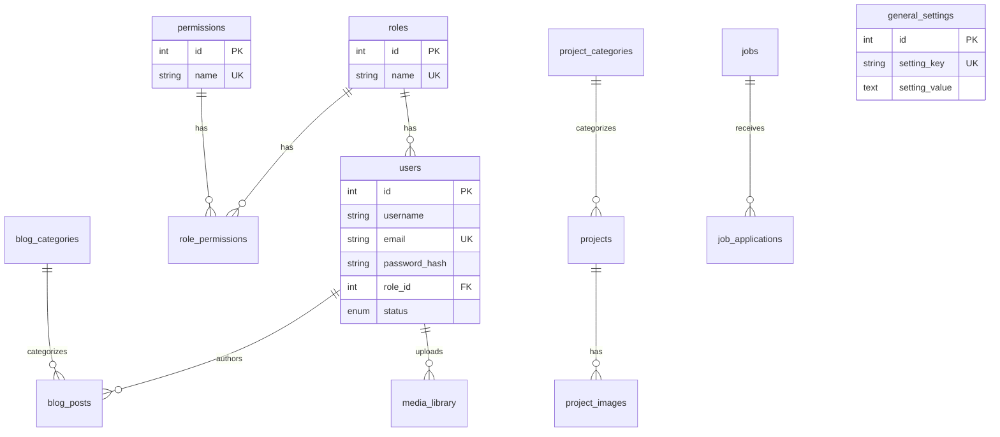
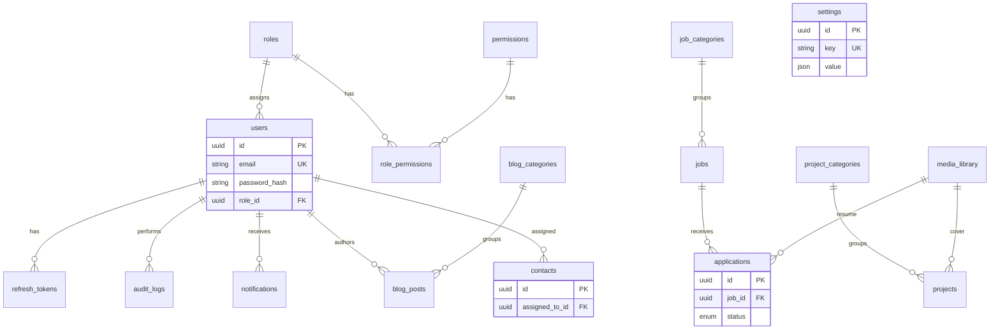

# PROJECT_AUDIT — UMQ Platform

**تاريخ التدقيق:** 2026-06-04  
**نطاق العمل:** إكمال المشروع الحالي وتحويله إلى نظام إنتاجي — **بدون إنشاء مشروع جديد**  
**مرجع قاعدة البيانات المحلية:** `C:\Users\ENG-OSAMA\Downloads\omq_db.sql` (MariaDB 10.4 / phpMyAdmin)  
**حالة المشروع:** Phase 1 — هيكل Monorepo + واجهات أساسية + API جزئي + Prisma/MySQL منفصل عن `omq_db`

---

## 1. ملخص تنفيذي

| البُعد | الحالة | الملاحظة |
|--------|--------|----------|
| هيكل Monorepo | ✅ جيد | `apps/api`, `apps/web`, `packages/*` |
| قاعدة البيانات التشغيلية | ⚠️ ازدواجية | **مخططان مختلفان:** `omq_db` (قديم) vs `umq_platform` (Prisma) |
| طبقة Data Access | ❌ غير مكتملة | Prisma مباشرة في Services؛ `RoleRepository` جزئي و`base.repository.ts` **مفقود** |
| Authentication | ⚠️ جزئي | Login / Refresh / Logout / `me` — بدون Forgot/Reset/Remember Me/HttpOnly |
| Authorization (RBAC) | ⚠️ جزئي | Guards على API؛ أدوار seed ≠ المطلوب (Admin/Manager/Employee/Customer/Guest) |
| Dashboards حسب الدور | ❌ | لوحة واحدة + فلترة Sidebar فقط |
| واجهة عامة + إدارة | ⚠️ | صفحات موجودة؛ كثير منها Mock أو CRUD غير مربوط بالـ API |
| الأمان | ⚠️ | ثغرات XSS/تخزين Token؛ لا Rate limit / CSRF / Helmet |
| الاختبارات | ❌ | لا Unit/Integration؛ لا `npm run test` في الجذر |
| الإنتاج | ❌ | غير جاهز للنشر |

**قرار معماري حرج:** لا يجوز دمج `omq_db.sql` مع Prisma **بدون** خطة ترحيل موثّقة. المخططان يختلفان في الأسماء، الأنواع (INT vs UUID)، الحقول، والعلاقات.

---

## 2. هيكل المشروع

```
umq-platform/
├── apps/
│   ├── api/                 # NestJS 11 — REST /api/v1
│   └── web/                 # Next.js 15 App Router — ar|en
├── packages/
│   ├── database/            # Prisma schema + migrations + seed
│   ├── shared/              # password hashing (scrypt)
│   ├── ui/                  # مكوّنات مشتركة (استخدام محدود)
│   ├── eslint-config/
│   └── typescript-config/
├── docker-compose.yml       # MySQL 8.4 (host :3307)
├── .github/workflows/ci.yml # lint + types + build (بدون test)
├── scripts/                 # مجلد legacy-db (فارغ تقريباً — انظر §12)
└── package.json             # turbo monorepo
```

### 2.1 الواجهات (حسب التقرير)

| الواجهة | المسار | الجمهور | الحالة |
|---------|--------|---------|--------|
| موقع عام | `apps/web/app/[locale]/(public)` | زوار | ✅ صفحات + Mock/HTTP جزئي |
| مصادقة | `apps/web/app/[locale]/(auth)` | موظفون | ⚠️ login؛ forgot-password غير مكتمل |
| لوحة إدارة | `apps/web/app/[locale]/admin` | super-admin, editor, hr, viewer | ⚠️ RBAC UI فقط |
| API | `apps/api` → `/api/v1` | Web + تكاملات | ⚠️ Phase 1 |

---

## 3. تحليل `omq_db.sql` (قاعدة MySQL المحلية)

**قاعدة البيانات:** `omq_db`  
**المحرك:** InnoDB, utf8mb4  
**المعرّفات:** `INT AUTO_INCREMENT` (ليست UUID)  
**البيانات:** فقط `general_settings` (4 صفوف) — باقي الجداول **فارغة** في الـ dump

### 3.1 الجداول (14)

| الجدول | PK | FKs | ملاحظات |
|--------|----|-----|---------|
| `users` | `id` | → `roles` | `username`, `status` enum — لا `slug` للدور |
| `roles` | `id` | — | `name` فقط — لا `slug` |
| `permissions` | `id` | — | `name` فقط — **لا** `slug` / `module` / `action` |
| `role_permissions` | (`role_id`,`permission_id`) | → roles, permissions | مركّب بدون `id` |
| `services` | `id` | — | `name`, `active/inactive` — لغة واحدة |
| `projects` | `id` | → `project_categories` | `name` unique — لا slug ثنائي اللغة |
| `project_categories` | `id` | — | |
| `project_images` | `id` | → `projects` | **غير موجود** في Prisma (يُستبدل بـ `cover_media_id`) |
| `blog_categories` | `id` | — | |
| `blog_posts` | `id` | → users, blog_categories | لغة واحدة؛ `tags`, `featured_image_url` |
| `jobs` | `id` | — | `open/closed` — لا categories |
| `job_applications` | `id` | → `jobs` | ≠ `applications` في Prisma |
| `media_library` | `id` | → users | حقول مختلفة عن Prisma |
| `general_settings` | `id` | — | ≠ `settings` (key/value JSON) |

### 3.2 ERD — `omq_db` (الواقع في الـ dump)



### 3.3 فحوصات الجودة على `omq_db`

| الفحص | النتيجة |
|-------|---------|
| مفاتيح أساسية | ✅ على كل جدول |
| مفاتيح خارجية | ✅ 8 قيود (انظر أدناه) — **لا FK** على `services`, `roles` standalone |
| جداول بلا FK لكن منطقية | `services`, `blog_categories`, `jobs`, `general_settings` |
| بيانات مكررة | ⚠️ محتملة مستقبلاً: `UNIQUE(name)` على services/projects/roles |
| جداول غير مستخدمة في الكود الحالي | **كلها** — التطبيق يستخدم Prisma `umq_platform` وليس `omq_db` |
| حقول غير مستخدمة | `username`, `tags`, `project_url`, `requirements`, `benefits` في legacy — لا mapping مباشر في Prisma |

**قيود FK في `omq_db.sql`:**
- `blog_posts` → `users`, `blog_categories`
- `job_applications` → `jobs`
- `media_library` → `users`
- `projects` → `project_categories`
- `project_images` → `projects`
- `role_permissions` → `roles`, `permissions`
- `users` → `roles`

---

## 4. مخطط Prisma الحالي (`umq_platform`)

**المصدر:** `packages/database/prisma/schema.prisma`  
**المزوّد:** MySQL  
**المعرّفات:** `CHAR(36)` UUID  
**الجداول:** 24 نموذجاً

### 4.1 ERD — مخطط الهدف (Prisma)



### 4.2 جداول Prisma **بدون** API أو UI حالياً

| الجدول | الاستخدام المخطط |
|--------|------------------|
| `team_members`, `partners`, `testimonials` | محتوى تسويقي — لا endpoints |
| `website_sections`, `seo_pages` | CMS — لا admin |
| `settings` | `settings:manage` seed فقط |
| `audit_logs` | `audit:read` seed فقط |
| `notifications` | لا واجهة |
| `media_library` | لا رفع ملفات |
| `contacts` (قراءة/إدارة) | POST عام فقط |
| `refresh_tokens` | ✅ auth داخلي |

### 4.3 مقارنة `omq_db` ↔ Prisma (ملخص الترحيل)

| Legacy (`omq_db`) | Prisma (`umq_platform`) | تعقيد الترحيل |
|-------------------|---------------------------|---------------|
| `users.id` INT | UUID | عالي — خريطة IDs |
| `users.username` | `firstName` + `lastName` | متوسط — تقسيم/افتراض |
| `permissions.name` | `permissions.slug` | عالي — تعريف slug جديد |
| `roles.name` | `roles.slug` | عالي |
| `services.name` | `slug`, `titleAr/En` | عالي — توليد slug |
| `projects.name` | `slug`, bilingual | عالي |
| `job_applications` | `applications` | متوسط — حقول مختلفة |
| `general_settings` | `settings` (JSON) | منخفض — 4 صفوف فقط |
| `project_images` | `coverMediaId` + media | متوسط |
| `blog_posts` أحادي اللغة | `BlogPost` per `locale` | عالي |

**توصية:** استيراد `omq_db.sql` إلى MariaDB للتحليل، ثم تشغيل **سكربت ترحيل** إلى `umq_platform` (لا تعديل Prisma ليطابق legacy دون موافقة). السكربتات `migrate:legacy` / `db:migrate:omq` في `package.json` **غير مكتملة** (ملفات ناقصة).

---

## 5. الشاشات والصفحات

### 5.1 موقع عام `(public)`

| الصفحة | المسار | API | الحالة |
|--------|--------|-----|--------|
| الرئيسية | `/[locale]` | جزئي | ✅ |
| من نحن | `/about` | Mock | ⚠️ |
| الخدمات | `/services` | GET public | ⚠️ |
| المشاريع | `/projects` | GET public | ⚠️ |
| المدونة | `/blog` | GET public | ⚠️ |
| الوظائف | `/careers` | GET + apply | ⚠️ زر التقديم غير موصول |
| تواصل | `/contact` | POST `/contacts` (HTTP) | ⚠️ |

### 5.2 مصادقة `(auth)`

| الصفحة | الحالة |
|--------|--------|
| `/login` | ✅ HTTP؛ Mock **لا** يحدّث cookie/store |
| `/forgot-password` | ❌ `forgotPassword` غير موجود في `AuthService` |
| `/reset-password` | ❌ غير موجودة |
| رابط forgot من login | ❌ |

### 5.3 لوحة الإدارة `admin`

| الصفحة | Sidebar | API CRUD | Route guard |
|--------|---------|----------|-------------|
| Dashboard | ✅ | إحصائيات جزئية | cookie فقط |
| Users | ✅ | ✅ API | permission UI فقط |
| Roles | ✅ | قراءة فقط API | ⚠️ |
| Services | ✅ | ✅ API | ⚠️ |
| Projects | ✅ | UI يتوقع CRUD — API **قراءة فقط** | ⚠️ |
| Blog | ✅ | نفس المشكلة | ⚠️ |
| Jobs | ✅ | نفس المشكلة + تبويب applications مكرر | ⚠️ |
| Applications | ✅ | PATCH status | ⚠️ |
| Settings | ❌ | لا API | — |
| Contacts inbox | ❌ | لا admin API | — |
| Media library | ❌ | — | — |
| Audit logs | ❌ | — | — |
| SEO / Website sections | ❌ | — | — |

### 5.4 صفحات مطلوبة وغير موجودة (حسب المواصفات)

| المطلوب | الحالة |
|---------|--------|
| Dashboard لكل Role (Admin, Manager, Employee, Customer) | ❌ |
| Customer portal (Orders, Requests, Profile) | ❌ |
| Guest = public فقط | ✅ جزئياً |
| Privacy / Terms | ❌ (نص footer بدون routes) |
| 403 Forbidden page | ❌ |
| صفحة Manager / Employee | ❌ |

---

## 6. APIs

### 6.1 موجودة (`/api/v1`)

**عامة:** `GET /`, `/health`, `/auth/login`, `/auth/refresh`, content public (services, projects, blog, jobs), `POST /contacts`, `POST /jobs/:slug/apply`

**محمية:** `/auth/logout`, `/auth/me`, `/users/*`, `/roles/*`, `/admin/services` (CRUD كامل), `/admin/projects|blog|jobs` (**GET فقط**), `/admin/applications`

### 6.2 ناقصة (مقارنة بالمواصفات والـ schema)

| المجال | Endpoints ناقصة |
|--------|-----------------|
| Auth | `POST /auth/forgot-password`, `reset-password`, `change-password`, Remember-me TTL |
| Auth cookies | `Set-Cookie` HttpOnly للـ refresh (حالياً JSON body فقط) |
| Roles | CRUD + `roles:manage` |
| Projects/Blog/Jobs | Admin POST/PATCH/DELETE |
| Contacts | Admin list/update/assign |
| Settings | CRUD `settings` |
| Media | Upload, list, delete |
| CMS | `website_sections`, `seo_pages`, team, partners, testimonials |
| Audit | `GET /admin/audit-logs` + كتابة تلقائية |
| Notifications | CRUD للمستخدم |
| Customer | `/customer/*` — غير موجود |

### 6.3 عدم تطابق Frontend ↔ API

- `httpCrud` يستدعي CRUD على projects/blog/jobs → **404**
- `GET /admin/applications/:id` — غير موجود في API
- `forgot-password` page → method غير معرّف في interface

---

## 7. Authentication الحالي

| الميزة | Backend | Frontend |
|--------|---------|----------|
| Login | ✅ email/password + JWT | ✅ HTTP |
| Logout | ✅ revoke refresh | ✅ |
| Refresh | ✅ rotation + hash | ✅ `apiFetch` 401 retry |
| Remember Me | ❌ | ❌ |
| Forgot Password | DTO فقط | ❌ صفحة مكسورة |
| Reset Password | DTO فقط | ❌ |
| Change Password | ❌ | ❌ |
| HttpOnly Cookies | ❌ | `umq_access` readable 15m |
| Refresh in HttpOnly | ❌ | localStorage `umq-auth` |

**ملاحظات:**
- `failedLoginCount` يزيد؛ `lockedUntil` **لا يُفعّل أبداً**
- Permissions داخل JWT → **قديمة** بعد تغيير الدور حتى refresh
- لا token blocklist عند تعطيل المستخدم

---

## 8. Authorization (RBAC)

### 8.1 الأدوار الحالية (seed)

| slug | الغرض | يطابق المواصفات؟ |
|------|-------|------------------|
| `super-admin` | `*` | ≈ Admin |
| `editor` | محتوى | ≠ Manager |
| `hr` | توظيف | جزء من Manager |
| `viewer` | قراءة | ≠ Employee |

**غير موجود:** `manager`, `employee`, `customer`, `guest` (guest = public بدون جدول)

### 8.2 Permissions (seed) — 18 slug

مستخدمة في API: جزء منها فقط. **غير موصولة:** `roles:manage`, `projects:manage`, `blog:manage`, `jobs:manage`, `settings:manage`, `audit:read`

### 8.3 طبقات الحماية

| الطبقة | الحالة |
|--------|--------|
| Backend Guards | ✅ JwtAuthGuard + PermissionsGuard |
| Middleware (web) | ⚠️ cookie presence فقط — لا JWT verify |
| AdminAuthGate | ✅ `getCurrentUser()` |
| Sidebar ديناميكي | ✅ `filterNavByPermissions` |
| Route-level 403 | ❌ |
| إخفاء أزرار حسب permission | ⚠️ جزئي (applications فقط) |

---

## 9. Dashboards

| الدور المطلوب | الواقع |
|---------------|--------|
| Admin Dashboard (إحصائيات، users، roles، logs) | ⚠️ dashboard عام + banners mock |
| Manager | ❌ |
| Employee | ❌ |
| Customer | ❌ |
| Guest | ✅ public pages |

---

## 10. UI/UX

| البند | الحالة |
|-------|--------|
| Tailwind v4 | ✅ `globals.css` + tokens |
| Framer Motion | ✅ motion components |
| Responsive / Mobile first | ⚠️ جزئي — يحتاج مراجعة صفحة صفحة |
| إزالة تكرار | ⚠️ applications في jobs + صفحة منفصلة |
| Dead code | `axios`, `next-themes` غير مستخدمين |
| i18n ar/en | ✅ |

---

## 11. الأمان — الثغرات والمخاطر

| التهديد | الخطورة | الوصف |
|---------|---------|--------|
| XSS → سرقة Token | **عالية** | access+refresh في localStorage |
| Cookie غير HttpOnly | **متوسطة** | `umq_access` قابل للقراءة من JS |
| CSRF | **متوسطة** | Bearer من localStorage أقل عرضة؛ مع cookies مستقبلاً يحتاج CSRF |
| SQL Injection | **منخفضة** | Prisma parameterized |
| Auth bypass | **متوسطة** | middleware يتحقق من cookie لا من JWT |
| Privilege escalation | **متوسطة** | URL admin مباشر بدون فحص permission على الصفحة |
| Brute force login | **عالية** | لا rate limiting |
| JWT secret default | **عالية** | fallback dev secret |
| Stale permissions in JWT | **متوسطة** | |
| Public POST spam | **متوسطة** | contacts, apply بدون rate limit |
| Seed password في logs | **منخفضة** | dev only |

---

## 12. جودة الكود

| الفئة | أمثلة |
|-------|--------|
| Dead code | `axios`, `next-themes` في web |
| Unused APIs (schema) | 10+ models بلا modules |
| Duplicate logic | mock layer + mocks/*.ts؛ applications UI مزدوج |
| Broken references | `RoleRepository` يستورد `./base.repository.js` **غير موجود** |
| Broken npm scripts | `db:migrate:omq`, `migrate:legacy` → ملفات غير موجودة |
| API لا يستخدم repositories | Prisma مباشرة في كل service |
| Tests | **0** ملفات `*.spec.ts` / `*.test.ts` |

---

## 13. الاختبارات و CI

| الأمر | الجذر | CI |
|-------|-------|-----|
| `pnpm lint` | ✅ turbo | ✅ |
| `pnpm check-types` | ✅ | ✅ |
| `pnpm build` | ✅ | ✅ |
| `pnpm test` | ❌ غير معرّف | ❌ |
| Unit / Integration | ❌ | ❌ |

---

## 14. المكتمل ✅

- Monorepo (pnpm + turbo)
- Prisma schema شامل + migration MySQL `20250603120000_init_mysql`
- Seed: roles, permissions, admin, عينات محتوى
- NestJS: modules أساسية، JWT guards، RBAC decorators
- Next.js: public + auth + admin، i18n، middleware، auth store
- Sidebar ديناميكي حسب permissions
- Docker MySQL + CI pipeline
- Password hashing (scrypt) في `@umq/shared`
- Refresh token hashing + rotation

---

## 15. غير المكتمل ❌

- ربط فعلي مع `omq_db` (ترحيل بيانات)
- طبقة Data Access كاملة + استخدامها في API
- Auth كامل (Forgot/Reset/Remember/HttpOnly/Change password)
- RBAC بالأدوار المطلوبة + dashboards منفصلة
- Admin CRUD لجميع الوحدات
- Settings, Contacts admin, Media, Audit, CMS modules
- Customer portal
- Route 403 + حماية صفحة بـ permission
- اختبارات + `npm run test`
- Production: env secrets, helmet, rate limit, logging, monitoring
- سكربت ترحيل legacy مكتمل

---

## 16. أخطاء معروفة (Bugs)

1. Mock login لا يحدّث `auth-store` / cookie → admin inaccessible في mock mode
2. Forgot-password يستدعي API method غير موجود
3. Admin projects/blog/jobs CRUD من الواجهة يفشل على HTTP (404)
4. `RoleRepository` / `base.repository` — كسر بناء إن استُخدمت دون إكمال
5. `package.json` scripts تشير لملفات غير موجودة

---

## 17. خطة التنفيذ (ملخص — التفصيل في `ROADMAP.md`)

### المرحلة 0 — قرار قاعدة البيانات (قبل كود)
1. استيراد `omq_db.sql` إلى MariaDB/MySQL محلي للتحليل.
2. اعتماد **`umq_platform` (Prisma)** كمصدر حقيقة للتطبيق.
3. بناء/إكمال `scripts/migrate-legacy-db.ts` وفق جدول mapping §4.3.
4. التحقق: `pnpm db:migrate:deploy && pnpm migrate:legacy` (بعد كتابة السكربت).

### المرحلة 1 — أساس إنتاجي
- إصلاح Auth (HttpOnly refresh, access قصير, forgot/reset, lockout, rate limit)
- إكمال repositories + refactor services
- Admin CRUD كامل + Contacts/Settings/Media/Audit APIs
- Route guards + 403 في web
- أدوار Manager/Employee/Customer + dashboards

### المرحلة 2 — جودة ونشر
- Unit + integration tests
- Security hardening
- `pnpm test` في CI
- توثيق deploy + `.env.production`

---

## 18. ملحق — Permission matrix (الحالي)

| Permission | API | Admin UI |
|------------|-----|----------|
| `users:*` | جزئي | users page |
| `roles:read` | ✅ | roles read-only |
| `roles:manage` | ❌ | ❌ |
| `services:*` | ✅ CRUD | ✅ |
| `projects:read` | ✅ | ✅ (write UI fails) |
| `projects:manage` | ❌ | UI yes |
| `blog:read` | ✅ | same |
| `jobs:read` | ✅ | same |
| `applications:*` | ✅ | ✅ |
| `settings:manage` | ❌ | ❌ |
| `audit:read` | ❌ | ❌ |

---

**الخطوة التالية الموصى بها:** تنفيذ Phase 1 من `ROADMAP.md` بعد موافقة على استراتيجية DB (ترحيل vs بداية نظيفة من seed). **لا يُبدأ تنفيذ Features قبل إغلاق قرار الترحيل.**
