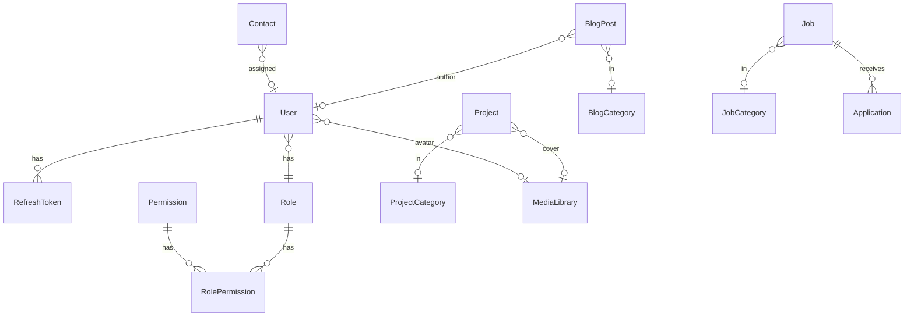

# Database Mapping — Prisma ↔ MySQL ↔ API ↔ Web

**تاريخ:** 2026-06-04  
**قاعدة البيانات:** `umq_platform` (MySQL 8 / MariaDB)  
**Migration:** `20250603120000_init_mysql`  
**Models:** 24 (Prisma) = 24 tables (`@@map`)

---

## 1. ملخص الربط

| الحالة | العدد | الجداول |
|--------|-------|---------|
| ✅ مربوط (API + UI جزئي/كامل) | 11 | users, roles, permissions*, role_permissions*, refresh_tokens*, services, projects, blog_posts, jobs, applications, contacts, testimonials |
| ⚠️ schema فقط / قراءة جزئية | 4 | project_categories, blog_categories, job_categories, permissions (قراءة عبر roles) |
| ❌ غير مربوط بـ API | 9 | team_members, partners, media_library, website_sections, seo_pages, settings, notifications, audit_logs |

\* `permissions` / `role_permissions` / `refresh_tokens`: مستخدمة داخلياً من Auth/RBAC وليس CRUD عام.

---

## 2. جدول تفصيلي — Model → Table → Keys → API

### Identity & Access

| Prisma Model | MySQL Table | PK | FKs | Indexes | API Module | Web |
|--------------|-------------|-----|-----|---------|------------|-----|
| `User` | `users` | `id` UUID | `role_id`→roles, `avatar_media_id`→media_library | email unique, role_id, deleted_at | `/users` admin CRUD | `/admin/users` |
| `Role` | `roles` | `id` | — | slug unique | `/roles` read | `/admin/roles` |
| `Permission` | `permissions` | `id` | — | slug unique | عبر JWT + seed | — |
| `RolePermission` | `role_permissions` | `id` | role_id, permission_id CASCADE | composite unique | seed فقط | — |
| `RefreshToken` | `refresh_tokens` | `id` | user_id CASCADE | user_id, token_hash | auth refresh/logout | auth-store |

**حقول غير مستخدمة بعد:** `User.avatarMediaId`, `createdById`, `updatedById`, `failedLoginCount`, `lockedUntil` (DB فقط), `locale` (جزئي).

### Services & Portfolio

| Model | Table | FKs | API | Web |
|-------|-------|-----|-----|-----|
| `Service` | `services` | — | public + admin CRUD | lists ✅ detail ❌ |
| `ProjectCategory` | `project_categories` | — | ❌ | ❌ |
| `Project` | `projects` | category_id?, cover_media_id? | public + admin CRUD | lists ✅ detail ❌ |

**حقول:** `technologies` JSON ✅ · `coverMediaId` ❌ · `categoryId` ❌ في forms

### Blog

| Model | Table | FKs | API | Web |
|-------|-------|-----|-----|-----|
| `BlogCategory` | `blog_categories` | — | ❌ | ❌ |
| `BlogPost` | `blog_posts` | category_id?, author_id?, cover_media_id? | public list + slug + admin CRUD | list ✅ detail ❌ |

**ملاحظة:** منشور واحد لكل `(slug, locale)` — التصميم صحيح للثنائية.

### Recruitment

| Model | Table | FKs | API | Web |
|-------|-------|-----|-----|-----|
| `JobCategory` | `job_categories` | — | ❌ | ❌ |
| `Job` | `jobs` | category_id? | public + admin + apply | careers ✅ detail ❌ |
| `Application` | `applications` | job_id, resume_media_id? | admin list/status/notes | admin ✅ |

### Marketing

| Model | Table | API | Web |
|-------|-------|-----|-----|
| `TeamMember` | `team_members` | ❌ | ❌ |
| `Partner` | `partners` | ❌ | ❌ |
| `Testimonial` | `testimonials` | GET published | home ✅ admin ❌ |

### CMS & Platform

| Model | Table | API | Web |
|-------|-------|-----|-----|
| `Contact` | `contacts` | POST public, admin list/PATCH | contact + admin inbox ✅ |
| `MediaLibrary` | `media_library` | ❌ | ❌ |
| `WebsiteSection` | `website_sections` | ❌ | about static |
| `SeoPage` | `seo_pages` | ❌ | ❌ |
| `Setting` | `settings` | ❌ | ❌ |
| `Notification` | `notifications` | ❌ | ❌ |
| `AuditLog` | `audit_logs` | ❌ | ❌ |

---

## 3. العلاقات (ER — مبسّط)

---

## 4. Enums ↔ MySQL ENUM

| Prisma | MySQL | Used in API |
|--------|-------|-------------|
| `ContentStatus` | DRAFT/PUBLISHED/ARCHIVED | services, projects, blog, jobs |
| `ApplicationStatus` | NEW…HIRED | applications |
| `ContactStatus` | NEW…CLOSED | contacts |
| `Locale` | AR/EN | users, blog_posts, website_sections, seo_pages |

---

## 5. خطة الربط (Phase 3 → 4)

### Priority A — Categories (FK موجودة، لا API)

1. `ProjectCategory` — `/admin/project-categories` + select في project form  
2. `BlogCategory` — `/admin/blog/categories`  
3. `JobCategory` — `/admin/job-categories`

### Priority B — CMS tables

4. `MediaLibrary` — upload + picker  
5. `WebsiteSection` — `/admin/website-sections` + about/home  
6. `SeoPage` — `/admin/seo` + metadata في layout  
7. `Setting` — `/admin/settings`

### Priority C — Marketing admin

8. `TeamMember`, `Partner` — admin CRUD + public sections  
9. `Testimonial` — admin CRUD (public read exists)

### Priority D — Platform

10. `Notification` — inbox per user  
11. `AuditLog` — read-only admin + writer middleware

### حقول audit على الكيانات

`createdById`, `updatedById` على Service/Project/Job/BlogPost: **موثّقة — تُفعّل مع AuditLog service (Phase 13).**

---

## 6. التحقق من Constraints

| Rule | Status |
|------|--------|
| All PKs UUID CHAR(36) | ✅ |
| Soft delete `deleted_at` on content | ✅ queried in services |
| Unique slugs per entity | ✅ |
| Blog `(slug, locale)` unique | ✅ |
| WebsiteSection `(key, locale)` unique | ✅ |
| SeoPage `(path, locale)` unique | ✅ |
| FK ON DELETE CASCADE | role_permissions, refresh_tokens |

---

## 7. Seed vs Production roles

| DB slug | Spec role | Match |
|---------|-----------|-------|
| super-admin | Super Admin | ✅ |
| editor | Editor | ✅ |
| hr | HR | ✅ |
| viewer | Viewer | ✅ |
| — | Admin, Manager, Employee, Customer | ❌ Phase 8 |

---

**Phase 3 status:** Mapping موثّق — تنفيذ الربط يبدأ Phase 4 (APIs) و Phase 12 (CMS).
